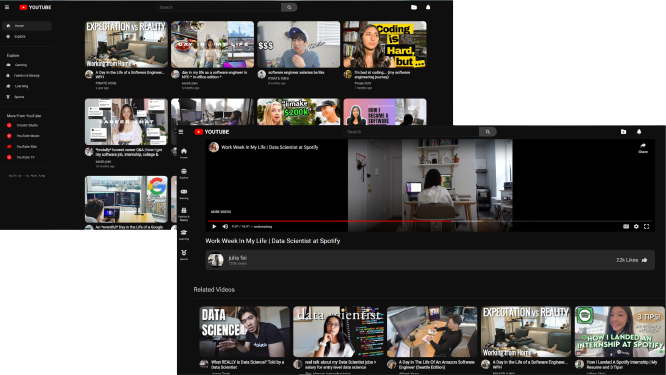

<div align="center">
  
</div>
<h1 align="center">
   YouTube Clone 
</h1>
<p align="center">
  <a href="https://ytbe.netlify.app/" target="_blank">  YouTube Clone </a> built with <a href="https://reactjs.org/" target="_blank"> React </a> and hosted with <a href="https://www.netlify.com/" target="_blank">Netlify</a>
</p>
<br />

### Click to <a href="https://ytbe.netlify.app/" target="_blank"> Visit </a>

<br />
<br />
 <a href="https://ytbe.netlify.app/" target="_blank">
    
  </a>
  
  <br />
<br />
  <br />
<br />

> The app is built by cloning youtube as exactly as possible with all the features & design mocks up.

 <br />
<br />

## Built with

```bash

 React

 Redux toolkit

 Scss ( Css pre-processor )

```

  <br />

## Used

```bash
 Vite       React-Router-Dom     Rapid API
```

  <br />

### Color Reference

| Color      | Hex        |
| ---------- | ---------- |
| Bg-Black   | `#0f0f0f`  |
| Text-white | ` #d3d3d3` |
| Hover-gray | `#3f3f3f`  |
| Border     | `#303030`  |

<br />

### Fonts

```bash
Roboto
```

<br />

## About

> **Include the ability to be responsive to all screen sizes.** <br> **Fast and reliable access to videos with Rapid API.** <br> **Include almost all features,that the original YouTube has.** <br> **Advanced data handling and customization with Redux toolkit.** <br> **Used Scss to handle design & file management.**

<br />
<br />
 
 
 <div align="center">
  
  <h6> Built By <a href="https://github.com/sumyat-aung/">Su Myat Aung</a></h1>
</div>
